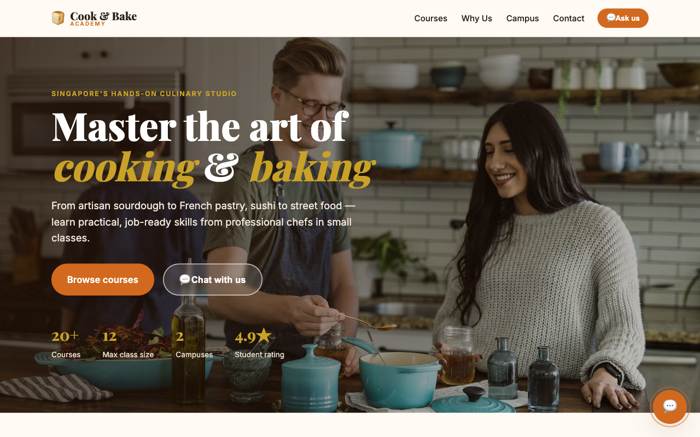

# Cook & Bake Academy — Cooking & Bakery Training Center (RAG Demo)


A one-page landing page for a cooking & bakery training center with a **customer-service
RAG chatbot**, plus the n8n automation to ingest 20 course brochures into a vector
database. Visitors can ask the chatbot about any course — **duration, fee, location,
schedule** — and get answers grounded in the brochures.

## Live Demo

🔗 **https://alfredang.github.io/n8n-ragdemo2/**



## What's inside

| Path | Description |
|------|-------------|
| [`website/`](website/) | One-page landing site (HTML/CSS/JS) with a floating RAG chatbot widget. Images from Unsplash. |
| [`brochures/`](brochures/) | 20 mock course brochures (`.txt`) — 10 bakery + 10 cooking — to upload to Google Drive. |
| [`n8n-workflows/`](n8n-workflows/) | 3 **manual-trigger** ingestion workflows (Supabase, Pinecone, Qdrant). |
| `CX Agent with RAG_superbase.json` | The answering RAG agent workflow (chat → retrieve → respond). |
| [`LEARNER-GUIDE.md`](LEARNER-GUIDE.md) | Step-by-step setup for Supabase, Pinecone & Qdrant vector databases. |

## Quick start

1. **View the site** — open [`website/index.html`](website/index.html) in a browser.
   Click the 💬 button and ask *"How much is the sourdough course?"*. It works offline
   via a local fallback until you wire in the n8n webhook.

2. **Set up a vector DB + ingest the brochures** — follow [`LEARNER-GUIDE.md`](LEARNER-GUIDE.md):
   upload the brochures to Google Drive, import an ingestion workflow, set credentials,
   and click **Execute workflow**.

3. **Connect the live chatbot** — set `WEBHOOK_URL` in [`website/script.js`](website/script.js)
   to your n8n CX Agent webhook URL.

## The 3 ingestion workflows (Manual Trigger)

Each does: **Manual Trigger → List Drive folder → Download each brochure → Split → Embed (OpenAI) → Upsert** into:

- [`1_Upload_Brochures_to_Supabase_Manual.json`](n8n-workflows/1_Upload_Brochures_to_Supabase_Manual.json) — Supabase pgvector
- [`2_Upload_Brochures_to_Pinecone_Manual.json`](n8n-workflows/2_Upload_Brochures_to_Pinecone_Manual.json) — Pinecone
- [`3_Upload_Brochures_to_Qdrant_Manual.json`](n8n-workflows/3_Upload_Brochures_to_Qdrant_Manual.json) — Qdrant

> Embeddings use OpenAI (1536 dimensions). Your vector table/index/collection must
> match that dimension — see the learner guide.

## Regenerate the brochures

```bash
cd brochures && python3 _generate_brochures.py
```
